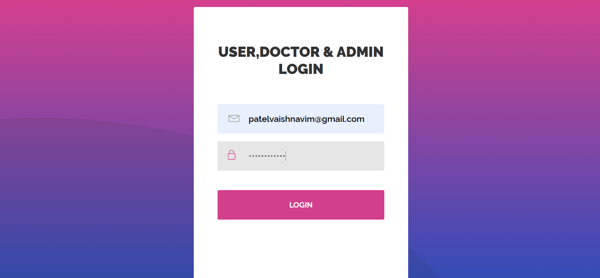
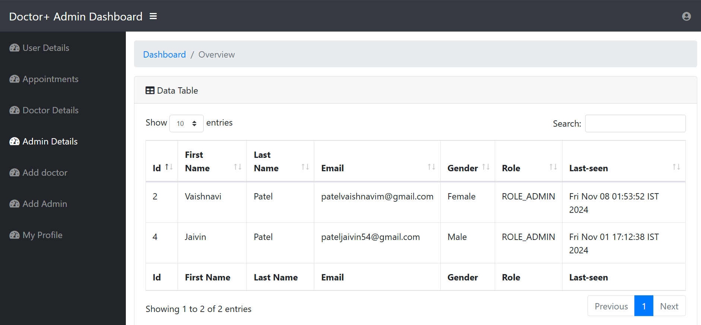

# CareConnect
CareConnect application enhances the patient-doctor experience by simplifying appointment management and enabling efficient access to essential information.

Requirements
-----------------------------
For building and running the application you need:

  JDK 1.8

  Maven 3
  
Running the application
--------------------------------
Download IDE for Spring Boot MVC (I have used Spring Tool Suite).
Open the project folder in your IDE and run it using command on your browser:

http://localhost:8080

CareConnect
----------------

# Login Page
-------------

# Register Page
-------------

## User Panel
--------------

# About 
-------

# Departments
----------

# Doctors
--------------

# Blog
-----------

# Contact us
---------------

# Appointment Booking 
---------------------

## Admin Panel
----------------------

## Doctor Panel
---------------------

